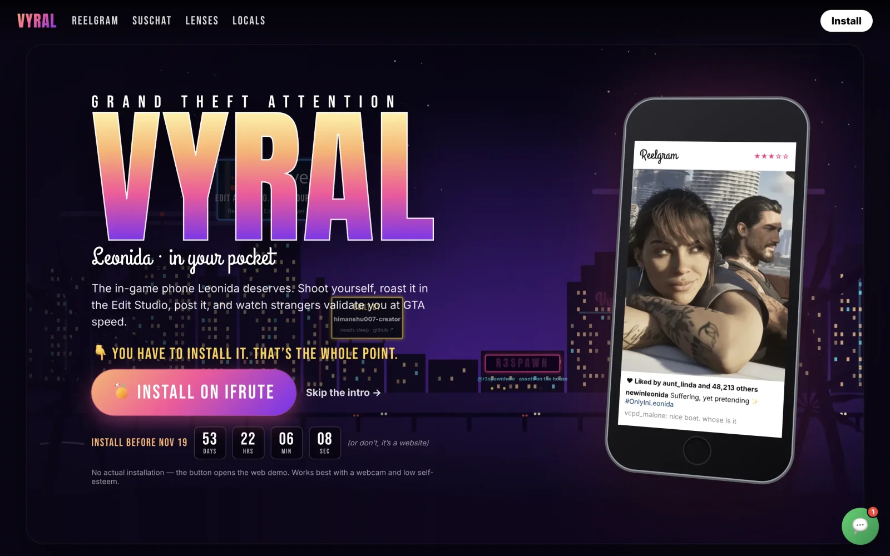
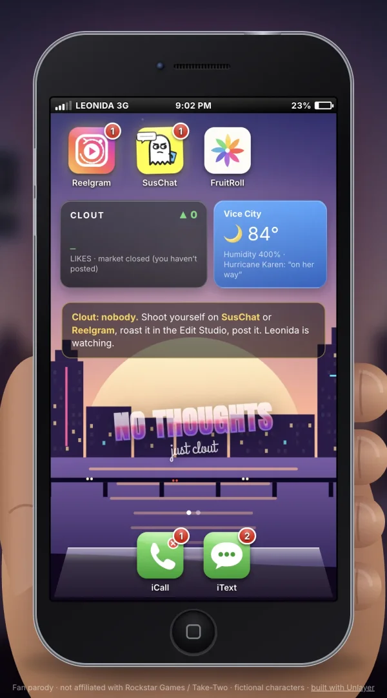
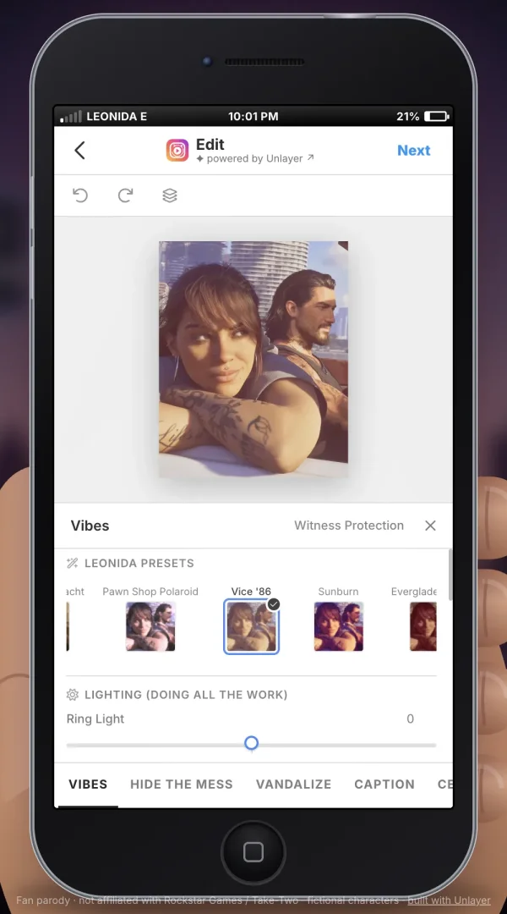
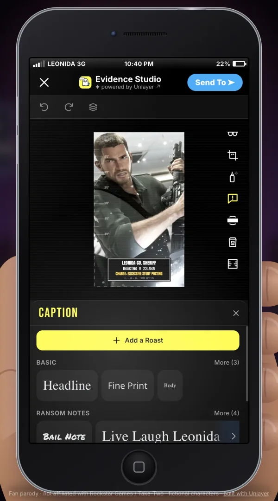
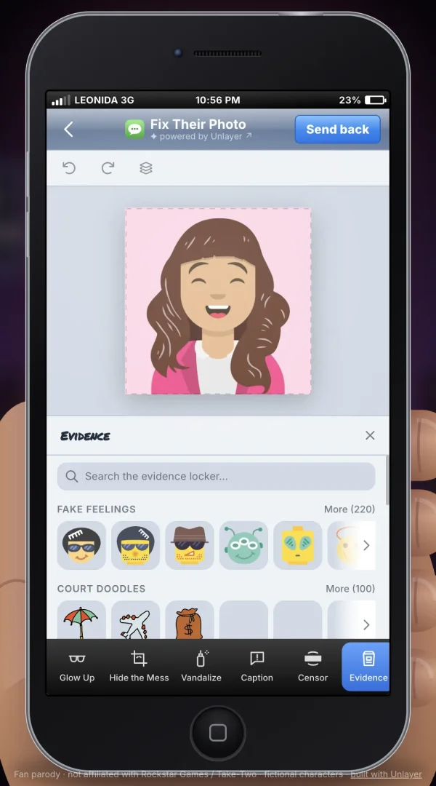

# VYRAL: *Grand Theft Attention*

**The in-game phone GTA VI deserves, and the [Unlayer React Image Editor](https://github.com/unlayer/react-image-editor?ref=himanshu007-creator-vyral) is how you play it.**

Shoot yourself, roast it in the Edit Studio, post it, and watch Leonida validate you at GTA speed.
Built for the [Unlayer "Build With React Image Editor" Challenge](https://unlayer.com/?ref=himanshu007-creator-vyral) · #BuiltWithImageEditor



<p align="center">
  
  
  
  
</p>

## What it is

A parody of Instagram/Snapchat validation culture, told the way Rockstar would tell it. Pull out a 2010s **iFrute** phone mid-game, *slide to regret*, and open:

| App | Parody of | The editor's job |
|---|---|---|
| 📸 **Reelgram** | Instagram | Edit your Post / Story / Reel before posting. Edited posts earn **7× the likes** |
| 👻 **SusChat** | Snapchat | Caption and sticker your snap (photo **or 5 s video**) before sending |
| 💬 **iText** | iMessage | Mom asks you to "make her photo look nice". You have tools. |
| 🌸 **FruitRoll** | Photos | Re-edit anything you ever saved |
| 📞 **iCall** | Phone | Missed calls from Det. Malone after ★★★ |

Clout works like a wanted level. Every notification is real and tappable, and nothing leaves the browser (IndexedDB, no backend).

## How Unlayer is integrated

The editor isn't embedded as a widget. It is reskinned into **four different apps**, and each one looks native (`src/studio/`).

1. **Custom header replaces Unlayer's toolbar.** We hide the editor's own Save/Cancel buttons and drive it from app-native buttons: Instagram's blue **Next**, Snapchat's **Send To ➤**, iText's **Send back**. They call `editor.getImage()` and `editor.hasChanges()` through the component `ref`.
2. **"✦ powered by Unlayer ↗" badge** sits in every Studio header and links to Unlayer with the ref.
3. **Four skins from one component.** `options` per skin sets `theme` (light/dark) and `features.imageEditor.dock` (left for Reelgram, right for SusChat, like the real apps).
4. **Custom tool icons.** Every tool has its own SVG via `features.imageEditor.tools.*.icon`: spray can for *Vandalize*, evidence bag for *Evidence*, censor bar for *Censor*, height chart for *Mugshot*. `resize` is disabled.
5. **90 labels rewritten** via `options.translations`:
   - Tools: Crop → *Hide the Mess*, Draw → *Vandalize*, Text → *Caption*, Shapes → *Censor*, Stickers → *Evidence*, Frame → *Mugshot*.
   - Presets: *Vice '86*, *Court Photo*, *Pawn Shop Polaroid*, *Everglades Humid*.
   - Controls and stickers: undo/redo → *Deny/Admit*, reset → *Witness Protection*, stickers → *Search the evidence locker…*
6. **Scoped CSS reskin** (`studio.css`). The editor renders in the light DOM, so its shadcn tokens (`--primary`, `--ring`) and Tailwind greys are remapped per skin. It is also re-laid-out for portrait:
   - Reelgram: canvas on top, bottom-sheet options, Instagram-style text tabs.
   - SusChat: floating icon rail with VHS scanlines.
   - iText: iOS 6 blue.
7. **Video editing on top of an image editor.** For 5 s clips:
   - Unlayer edits a transparent PNG whose pixels are all alpha 1/255.
   - We scan Unlayer's canvas for those marker pixels to find the image rect, then pin a looping `<video>` exactly underneath. You draw over live footage.
   - On export, the overlay is burned into every frame with Canvas + `MediaRecorder` (`src/lib/video.js`).
   - Video mode swaps in a layer-only tool set (`videoOptions`).
8. **The editor is the progression system.** `hasChanges()` feeds the clout maths (`src/lib/clout.js`): edited posts peak at 7× the likes, more stars, and a *MISSION PASSED* banner.
9. **Resilience.** `onLoad`, `onError` and `onLoadError` drive an in-phone loading screen with rotating jokes and a *"No signal in the Everglades"* retry. A `key` remount retries cleanly.
10. **Stable options.** Skins are module constants, because `features` is remount-tier and must keep a stable identity.
11. **Unlayer in the world.** Links carry the ref in all of these:
    - a clickable skyline billboard (*"Edit anything. Even your past."*)
    - a Sponsored post in the Reelgram feed
    - a home-screen widget
    - the footer credits

## Details worth finding

- Cold open with a zoom into a hand-built Vice City. The skyline cross-fades dawn → day → sunset → night every real minute.
- The hand picks up the phone, shows the iFrute back (six hexagon cameras and a LiDAR joke), flips it and taps it awake.
- Separate formats: Reelgram Post, Story and Reel. Stories get fake views and likes plus a "Seen by" sheet. Reels scroll infinitely.
- Two lens systems:
  - Reelgram has Instagram colour grades (*Clout-endon, Juno Debt, Vice-lencia, Larceny*).
  - SusChat has Snap overlay lenses around the shutter (*Mugshot, Breaking News, Most Wanted, Vice '86*).
- Portrait and landscape phone. Reelgram and SusChat refuse landscape and bounce back with a toast.
- **Live Miami radio** as the soundtrack: [MundoRadio](https://www.mundoradio.fm/?ref=himanshu007-creator-vyral) streams the moment you enter `/app`, found via [radio-browser.info](https://www.radio-browser.info/?ref=himanshu007-creator-vyral), with two Miami stations as fallbacks. One toggle mutes the radio and all sound effects.
- Incoming-call takeovers, battery drain, typing indicators, a ringtone and the mission-passed sound.
- **The URL is the state:** `/app?phone=up&app=reelgram&view=feed`. Every screen is linkable, and Back works.
- The landing page has a fake install flow, a countdown, and *Leonida Support*, a chat whose only answer is "install now".

## Run

```sh
npm install
npm run dev     # / = landing, /app = the phone   (Node ≥ 20.19)
npm run build   # static dist/ (vercel.json + _redirects included)
```

Stack: React 19, Vite, `@unlayer/react-image-editor`, `getUserMedia`, Canvas 2D, MediaRecorder, IndexedDB. No router, no state library, no UI kit.

## Credits

- Built by [himanshu007-creator](https://github.com/himanshu007-creator?ref=himanshu007-creator-vyral)
- Editor by [Unlayer](https://unlayer.com/?ref=himanshu007-creator-vyral)
- Avatars by [DiceBear](https://www.dicebear.com/?ref=himanshu007-creator-vyral)
- Stills by [@r3spawnhere](https://www.instagram.com/r3spawnhere/?ref=himanshu007-creator-vyral)

> **Legal:** VYRAL is an independent, non-commercial fan parody. It is not affiliated with or endorsed by Rockstar Games, Take-Two Interactive, Meta, Snap Inc., Apple or any company referenced. GTA is a trademark of Take-Two Interactive. All characters, apps and events are fictional. Clips and artwork belong to their credited creators and are used for commentary. Nothing leaves your browser.
